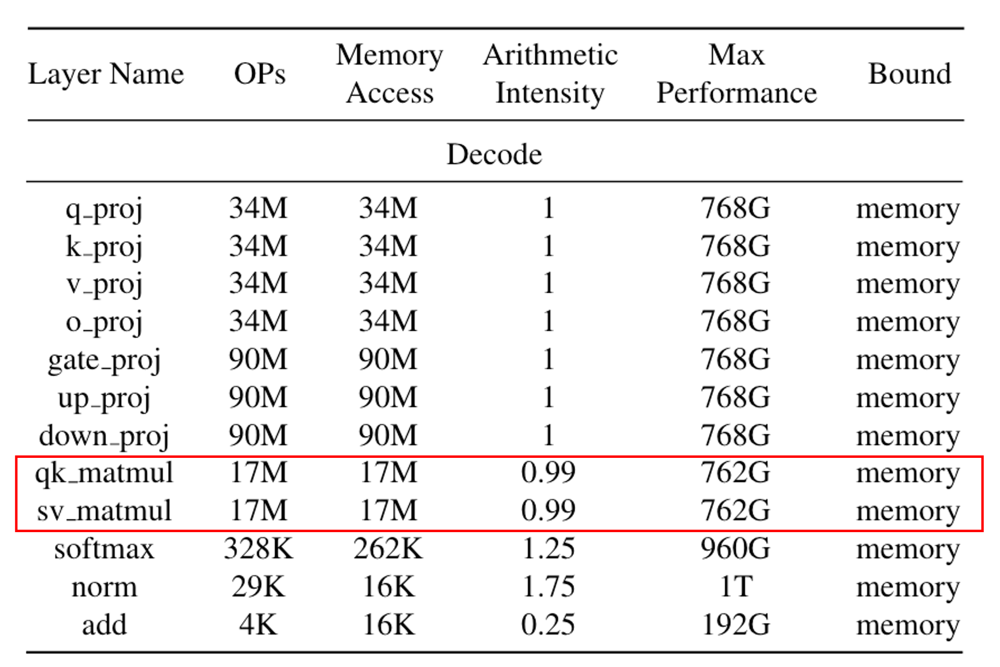
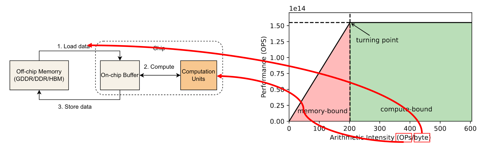

## 1.Background
The decoding process in KV Cache architectures predominantly encounters a memory-bound bottleneck, as highlighted by the profiling metrics that demonstrate memory access speeds are limiting the system's maximum performance. This constraint is evident from the significant operations per second (OPs) required by various layers, such as q-proj and k-proj, where memory access demands are high. 

As the arithmetic intensity is low, the operations are not compute-bound, but rather restricted by the rate at which data can be fetched and stored. The roofline model visualizes this phenomenon, clearly delineating the transition from memory-bound to compute-bound regions, with the decoding steps lying within the memory-bound section. Such insights into the performance bounds are crucial for optimizing hardware and software configurations to alleviate memory-related limitations and enhance overall system efficiency.

