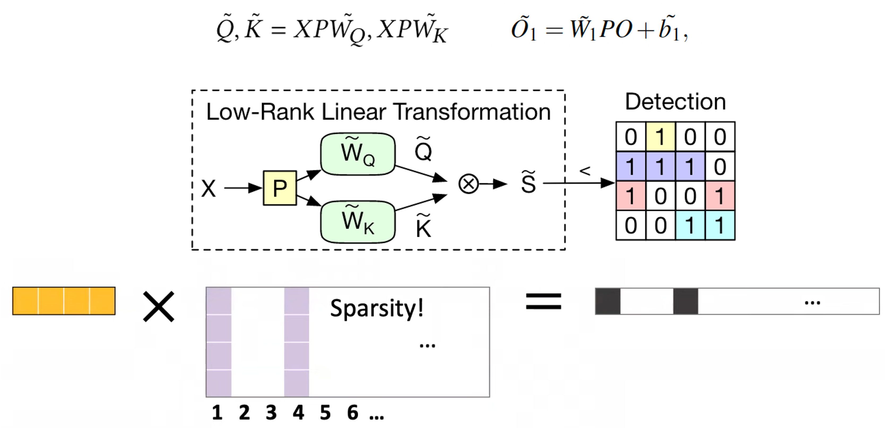
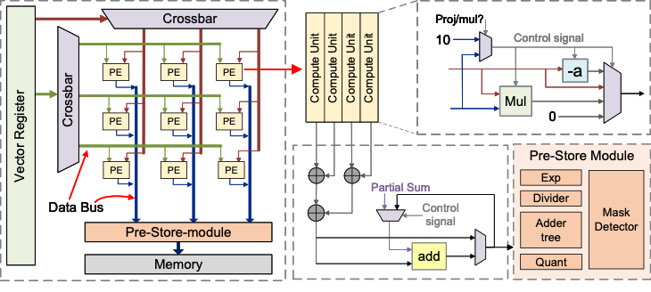

## 1.Background
The decoding process in KV Cache architectures predominantly encounters a memory-bound bottleneck, as highlighted by the profiling metrics that demonstrate memory access speeds are limiting the system's maximum performance. This constraint is evident from the significant operations per second (OPs) required by various layers, such as q-proj and k-proj, where memory access demands are high. 

As the arithmetic intensity is low, the operations are not compute-bound, but rather restricted by the rate at which data can be fetched and stored. The roofline model visualizes this phenomenon, clearly delineating the transition from memory-bound to compute-bound regions, with the decoding steps lying within the memory-bound section. Such insights into the performance bounds are crucial for optimizing hardware and software configurations to alleviate memory-related limitations and enhance overall system efficiency.

One viable strategy for enhancing performance within this architecture is to minimize the volume of data transfer between the off-chip memory and the computation units. By reducing the need for frequent memory accesses, which currently act as a bottleneck due to limited memory bandwidth, we can shift the operational point closer to the compute-bound region. This approach can potentially elevate performance closer to the system's peak computational capabilities, as shown in the roofline model, and ultimately optimize the data throughput for the decoding phase of KV Cache processes.

## 2. Algorithm

In the outlined algorithm, we implement a random projection method to predict the specific key-value pairs that should be retrieved from the KV cache. By doing so, the system strategically selects only the relevant data, which significantly reduces unnecessary memory accesses and computations. This targeted approach ensures that computations are only executed for the corresponding KV pairs that are deemed necessary, based on the projection. Consequently, this leads to a more efficient use of resources and potentially accelerates the overall processing time by avoiding the overhead associated with handling superfluous data. The algorithm's efficacy is underpinned by the low-rank linear transformation that facilitates a sparse representation, thereby streamlining the detection and retrieval process of the relevant KV pairs for subsequent computational tasks.

## 3. Hardware Design

To further enhance the performance of the algorithm, we have meticulously designed a specialized hardware architecture. This architecture is strategically optimized to facilitate faster algorithm implementation, featuring an array of processing elements (PEs) organized in a crossbar configuration for efficient data routing and parallel processing capabilities. The integration of a pre-store module with the memory ensures a seamless flow of data, while the control signals are fine-tuned to synchronize the activities of the computational units, which include multiply (Mul) and addition (Add) operations, among others. Essential functions such as exponentiation, division, and quantization are allocated to dedicated components within the pre-store module, enabling a highly efficient execution pipeline that significantly reduces latency and enhances throughput. This custom hardware setup is engineered to meet the intensive computational demands of the algorithm, ensuring rapid data processing and a higher overall efficiency.

## 4. Results

We compared with some baselines:

