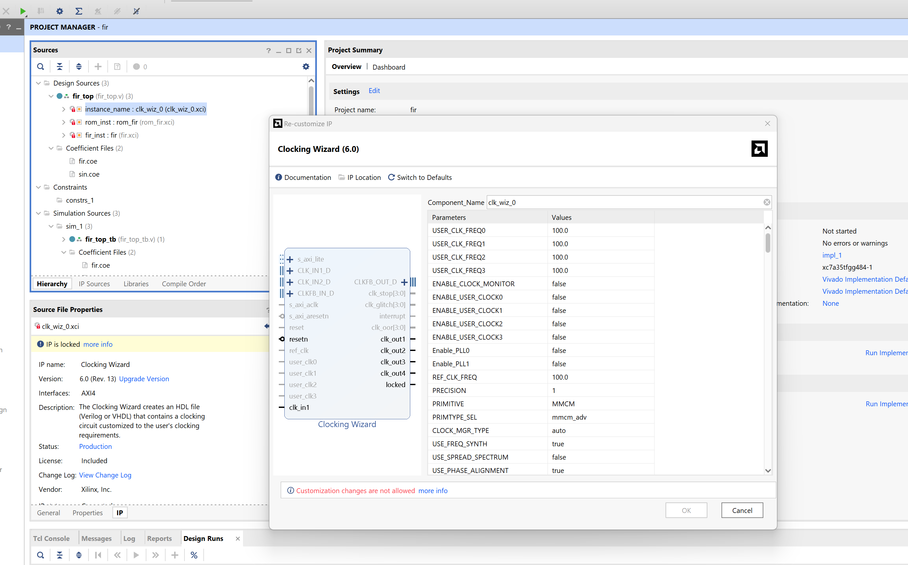
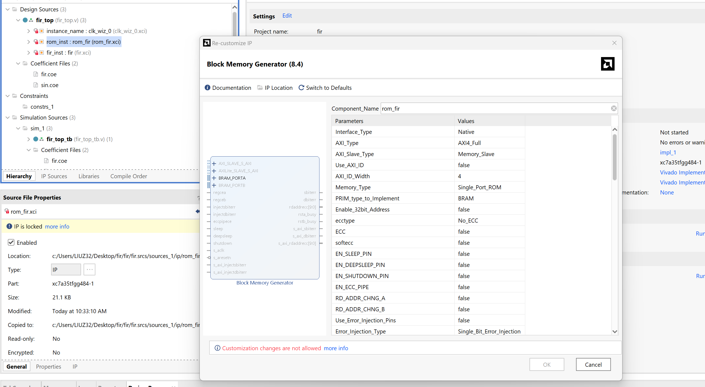
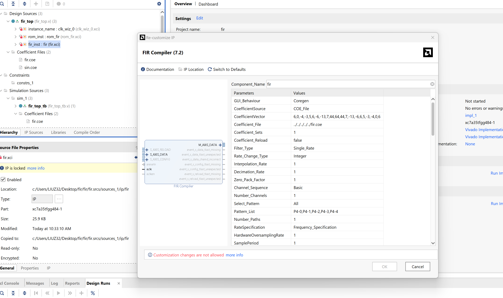
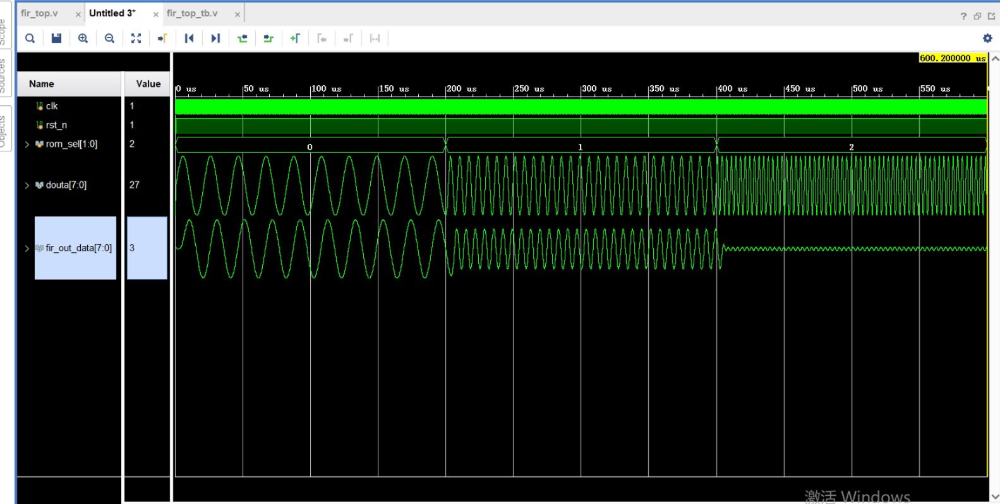

# ECSE6680-VLSI-Course-Project
This project is divided into 4 steps:
FIR low pass filter:
1. MATLAB generation of COE files for fir filter coefficients and signal generator
2. Generate fir IP core and ROM IP core (vivado)
3. Write top-level .v file to exemplify fir and ROM
4. Perform top-level engineering simulations
***
## 1. MATLAB generation of COE files for fir filter coefficients and signal generator
Open the fdatool in MATLAB and set the low pass filter:

After setting we can see:

Then export the coefficients of the FIR as the *coe* format to be used in Vivado IP core:


Use sin signal generator to validate the performance of our FIR:


## 2. Generate FIR IP core and ROM IP core (vivado)
Overview of the structure:




## 3. Write top-level .v file to exemplify fir and ROM
The .v file is as below:
```
`timescale 1ns / 1ps

module fir_top(
    input clk,
    input rst_n,
    input [1:0]rom_sel,
    output [7:0]douta,
    output [7:0]fir_out_data
    );
    
    wire clk_1;
    wire clk_2;
    wire clk_3;
    wire clk_10m;
    
    clk_wiz_0 instance_name(
        .clk_out1(clk_1),     // output clk_out1
        .clk_out2(clk_2),
        .clk_out3(clk_3),
        .clk_out4(clk_10m),
        .resetn(rst_n), // input resetn
        .locked(),       // output locked
        .clk_in1(clk)
    );      // input clk_in1
    
    wire clk_rom;
    assign clk_rom = (rom_sel == 0)?clk_1:((rom_sel == 1)?clk_2:clk_3);
    
    reg [9:0]addra;
    always@(posedge clk_rom or negedge rst_n)begin
        if(!rst_n)
            addra <= 'd0;
        else
            addra <= addra + 1'b1;
    end
    
      
    rom_fir rom_inst (
        .clka(clk_rom),    // input wire clka
        .ena(1'b1),      // input wire ena
        .addra(addra),  // input wire [9 : 0] addra
        .douta(douta)  // output wire [7 : 0] douta
    );

    wire [7:0]fir_in_data;
    assign fir_in_data = douta - 'd128;

    fir fir_inst (
        .aclk(clk),                              // input wire aclk
        .s_axis_data_tvalid(clk_10m),  // input wire s_axis_data_tvalid
        .s_axis_data_tready(),  // output wire s_axis_data_tready
        .s_axis_data_tdata(fir_in_data),    // input wire [7 : 0] s_axis_data_tdata
        .m_axis_data_tvalid(),  // output wire m_axis_data_tvalid
        .m_axis_data_tdata(fir_out_data)    // output wire [7 : 0] m_axis_data_tdata
    );

endmodule

```

The testbench file:
```
`timescale 1ns / 1ps


module fir_top_tb;

    reg clk;
    reg rst_n;
    reg [1:0]rom_sel;
    wire [7:0]douta;
    wire [7:0]fir_out_data;
    
    fir_top fir_top_inst(
        .clk    (clk),
        .rst_n  (rst_n),
        .rom_sel(rom_sel),
        .douta  (douta),
        .fir_out_data(fir_out_data)
    );
    
    initial clk = 0;
    always#10 clk = ~clk;
    
    initial begin
        rst_n = 0;
        rom_sel = 0;
        #200;
        rst_n = 1'b1;
        #200000;
        rom_sel = 1;
        #200000;
        rom_sel = 2;
        #200000;
        $stop;
    end
    
endmodule

```
## 4. Perform top-level engineering simulations

The simulation result:

