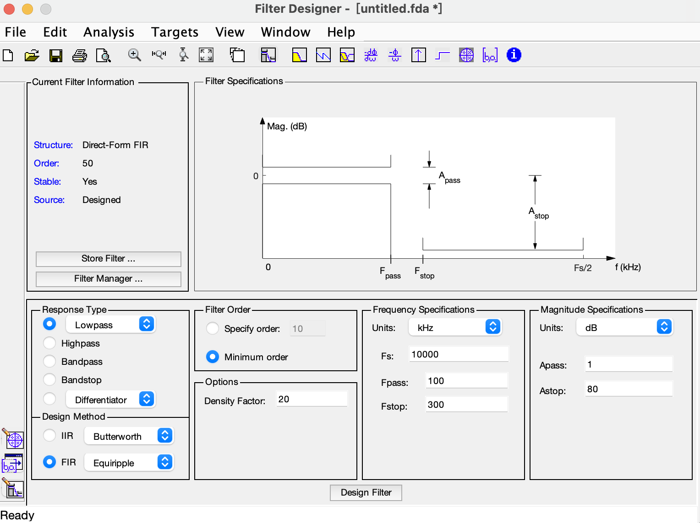
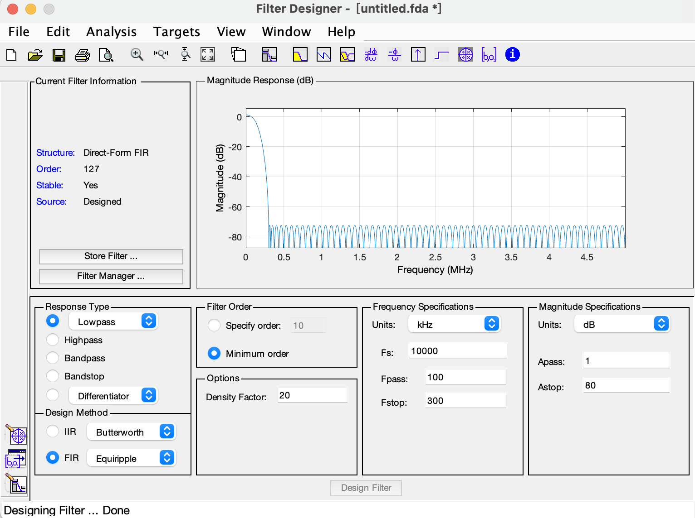
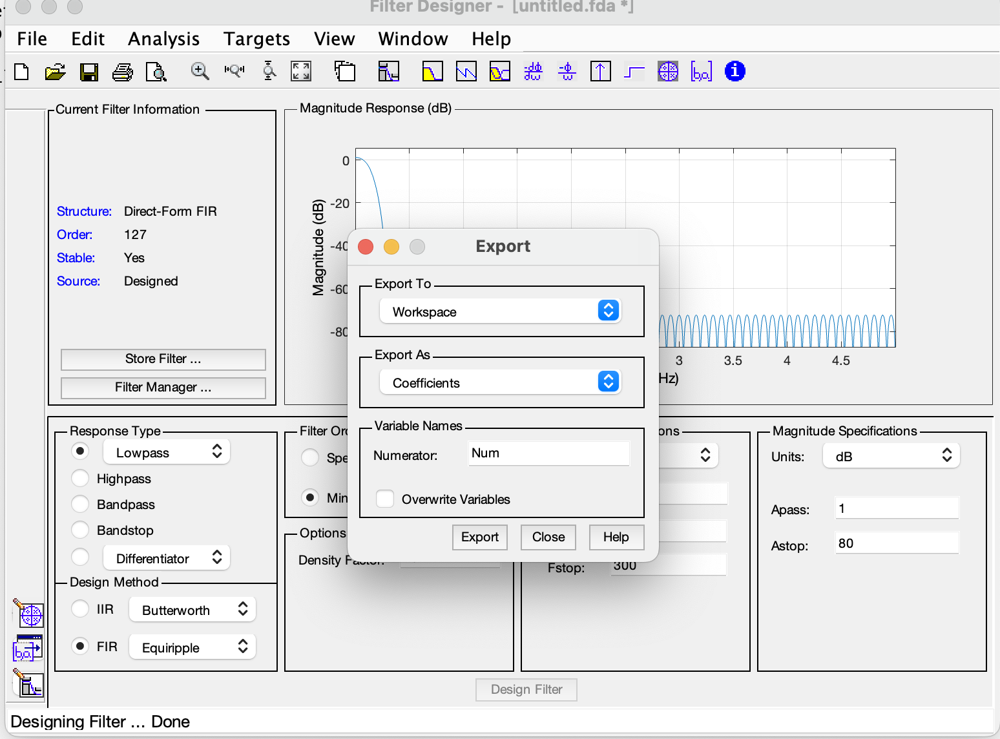
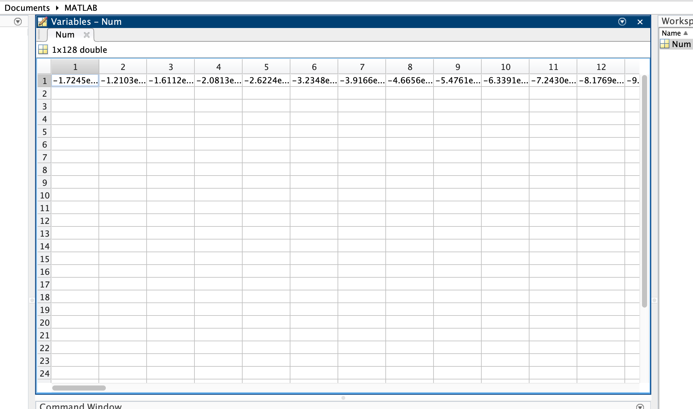
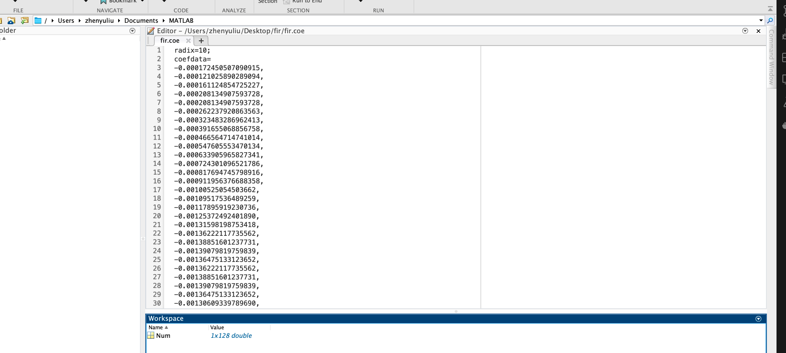
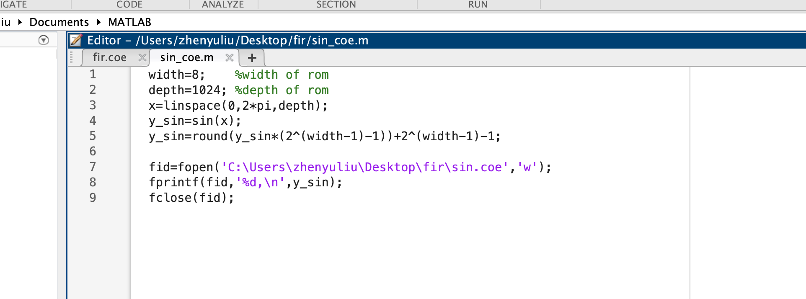
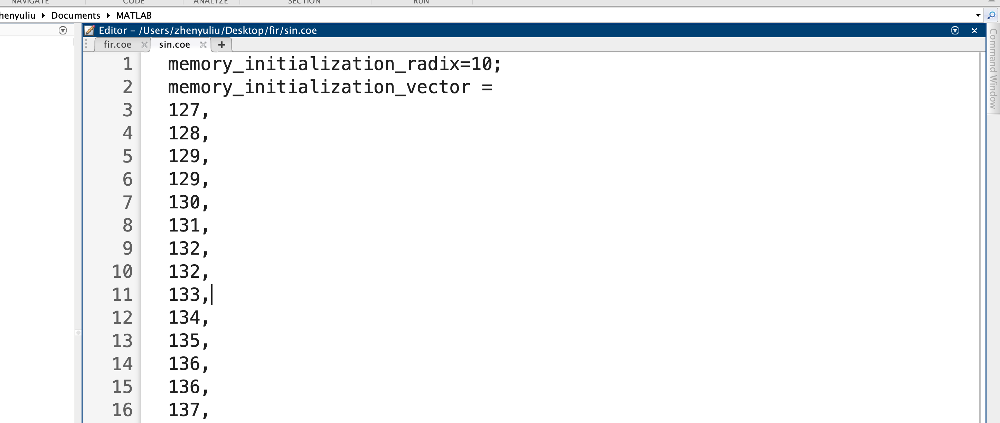
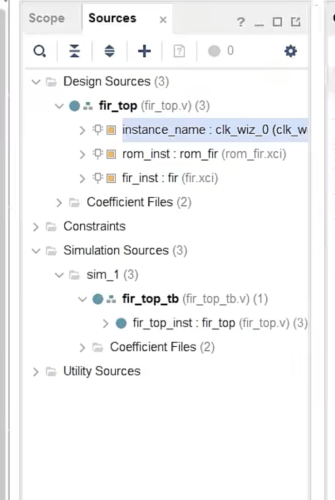

# ECSE6680-VLSI-Course-Project
This project is divided into 4 steps:
FIR low pass filter:
1. MATLAB generation of COE files for fir filter coefficients and signal generator
2. Generate fir IP core and ROM IP core (vivado)
3. Write top-level .v file to exemplify fir and ROM
4. Perform top-level engineering simulations
***
## 1. MATLAB generation of COE files for fir filter coefficients and signal generator
Open the fdatool in MATLAB and set the low pass filter:

After setting we can see:

Then export the coefficients of the FIR as the *coe* format to be used in Vivado IP core:



Use sin signal generator to validate the performance of our FIR:



## 2. Generate FIR IP core and ROM IP core (vivado)
Overview of the structure:


```

```
